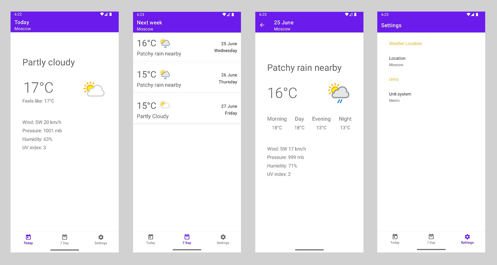

# ForecastMe

## Project Description

ForecastMe is a pleasant, minimalist weather app built entirely in Kotlin using modern architecture principles.

It lets you effortlessly view current weather conditions and a detailed 7-day forecast for any location worldwide, with the option to choose your preferred unit system.

ForecastMe interacts with two external services — **OpenCage Geocoder** ([opencagedata.com](https://opencagedata.com/)) for location data and **WeatherAPI** ([weatherapi.com](https://www.weatherapi.com/)) for weather information. The app also leverages intelligent caching to minimize network calls and ensure a fast, responsive experience.

## Architecture

ForecastMe is built following the principles of **Clean Architecture**, ensuring clear separation of concerns across multiple layers: presentation, domain, and data. The **MVVM (Model-View-ViewModel)** pattern is used in the presentation layer to promote a unidirectional data flow and improve testability.

The project also adheres to the **SOLID** principles, which help make the codebase scalable, maintainable, and easy to understand.

A **Repository Pattern** is implemented to abstract data sources and provide a clean API to the rest of the application. This approach helps to manage remote and local data more efficiently and makes future extensions easier.

**Dependency Injection** is used across all layers to support clean separation of concerns and ease of testing.

## Tech Stack

ForecastMe is built with a modern and reactive Android tech stack to ensure clean, efficient, and maintainable code.

The app leverages a variety of modern libraries and tools, including:

- **Coroutines & Flow** – for asynchronous operations and reactive data flow
- **ViewModel** – lifecycle-aware UI-related data management
- **LiveData** – observable data holder class for UI updates
- **Hilt** – dependency injection framework
- **Retrofit** – HTTP client for API communication
- **Gson** – JSON parsing library
- **Kotlin Serialization** – JSON serialization/deserialization
- **Room** – local database for caching and offline access
- **Glide** – image loading and caching
- **Navigation Component** – in-app navigation handling
- **Material Design Components** – consistent and modern UI elements
- **OkHttp Logging Interceptor** – network traffic logging

This combination provides a solid foundation for building a responsive, user-friendly, and maintainable Android application.

## Screenshots

